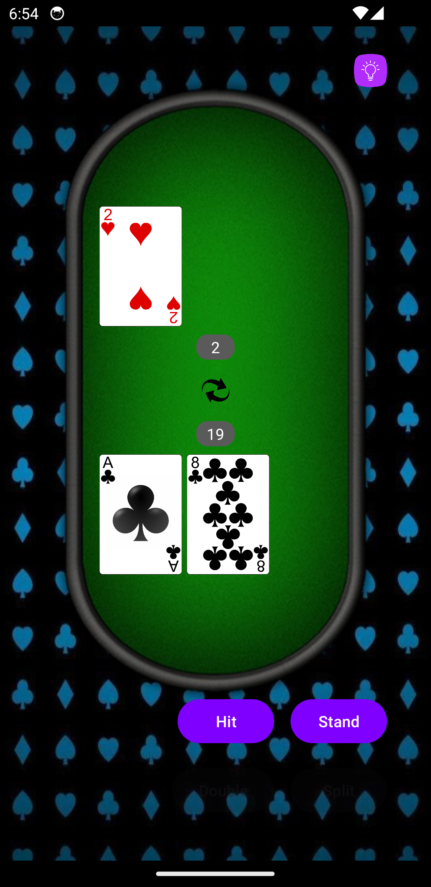

#  Black Jack App

This is an implementation of the game Blackjack as an Android application.

I took on this project to demonstrate my knowledge of Android application development gained from work experience and my studies
in university. The project also gave me the chance to explore new components and techniques such as using a navigation graph and
incorporating animations.

Since this is a single-player version, the dealer will continue to hit while the sum of player's cards are less than the sum of
dealer's cards and the dealer has not yet bust.

| Main Screen          | Play Screen          | Play Screen 2          | Settings Screen          |
|----------------------|----------------------|------------------------|--------------------------|
|  |  |  |  |

## Structure

The `Card` class contains all the information needed to identify a playing card. The `Shoe` class makes use of `Card` to initialize a
standard deck of 52 playing cards, then takes an integer as input to determine how many decks will make the shoe. The `Hand` class
maintains a list of `Card`s and its sum that a player has at any point. The sum is stored as `LiveData` and observed in the
`PlayFragment` to seamlessly update the user interface.

Currently, the `GameViewModel` creates a `Hand` instance for the dealer and player as well as an instance of the `Shoe`. The
`PlayFragment` can then access the `Hand` for a player through the `GameViewModel` and perform operations such as "Hit" - adding the
top `Card` from the `Shoe` to the `Hand`.

Along with that, the `CardAdapter` class is used for the dealer's and player's cards to be displayed using `RecyclerView`s in the
`PlayFragment`. This is also where the flipping card animation is performed when adding a new card.

Then, there is the `SettingsFragment`, which allows the user to change between left- and right-handed modes, moving the action buttons 
in `PlayFragment` to the appropriate side of the screen. The setting is stored using `SharedPreferences` and can therefore be restored
after a kill and relaunch of the application.

Lastly, the `MainFragment` and `MainActivity` bring everything together with the help of all the resources - drawables, layouts,
navigation, and values. 

Initially, I had Hand in `GameViewModel` as `LiveData`, which was then observed in `PlayFragment` and notified the recycler adapter
whenever the data set changed. However, I later changed to the current approach of simply having `Hand` as an object and
notifying the recycler adapter more efficiently when the dataset changed (by providing the specific index).

## Features

1. Play blackjack with hit and stand actions
2. Ask for hint to get optimal strategy calculation
3. Display hand sums for each player and a message to indicate winner/bust
4. Switch between left- and right-handed modes
5. Restart whenever and play as long as you like

## Roadmap

1. Incorporate betting system
2. Implement double and split actions

## Credits

[Tiled Background Image](https://static.vecteezy.com/system/resources/previews/002/582/114/non_2x/modern-abstract-casino-background-with-shiny-blue-playing-cards-signs-poker-symbols-on-black-background-casino-symbols-widescreen-wallpaper-vector.jpg) \
[Table Image](https://www.nicepng.com/ourpic/u2w7q8o0a9a9u2q8_poker-table-png-poker-table-online/)

[Card Images](https://code.google.com/archive/p/vector-playing-cards/downloads)

[Card Flip Animation](https://medium.com/geekculture/how-to-add-card-flip-animation-in-the-android-app-3060afeadd45)

[Play Icon](https://www.flaticon.com/free-icon/play-button-arrowhead_27223) \
[Refresh Icon](https://www.flaticon.com/free-icon/refresh-buttons_16498)

[Optimal Strategy](https://www.beatingbonuses.com/bjstrategy.php?decks=6&soft17=hit&doubleon=any2cards&peek=off&das=on&surrender=no&opt=1&btn=Generate+Strategy)

[Bulb Icon](https://www.flaticon.com/free-icon/bulb_11455502)
